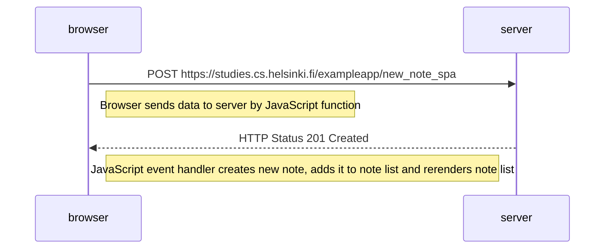

```mermaid
sequenceDiagram
    participant browser
    participant server

    browser->>server: POST https://studies.cs.helsinki.fi/exampleapp/new_note_spa
    Note right of browser: Browser sends data to server by JavaScript function
    server-->>browser: HTTP Status 201 Created

    Note right of browser: JavaScript event handler creates new note, adds it to note list and rerenders note list
```